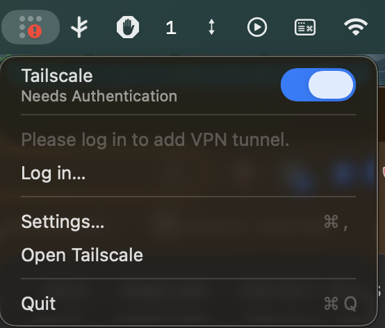
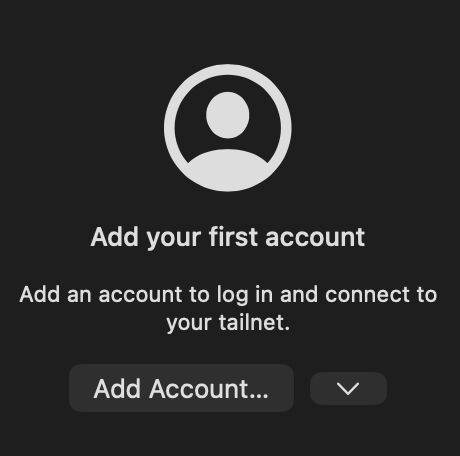
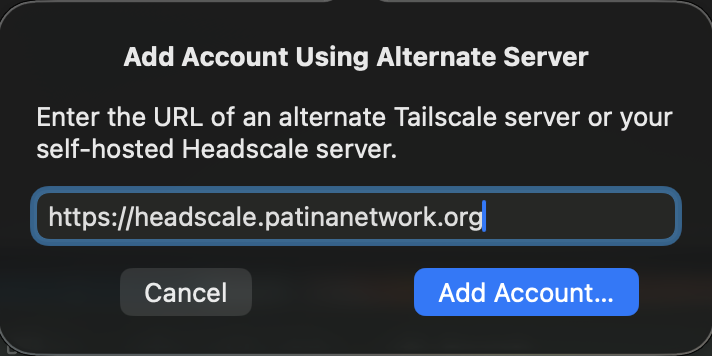
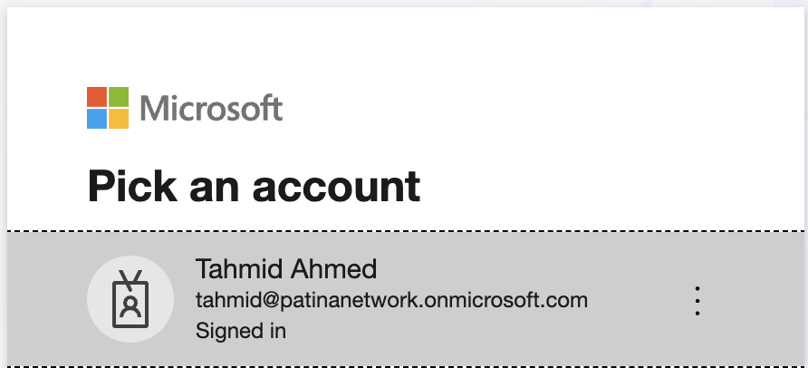
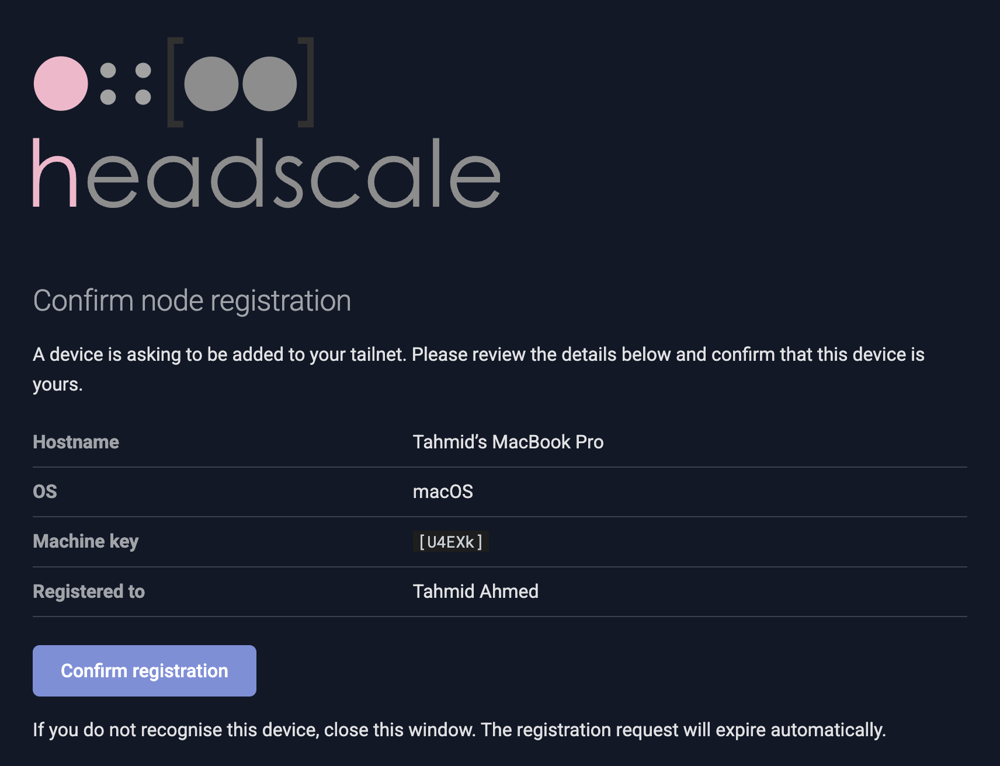

# How to connect to VPN

Follow these instructions if you need to access services that are on `*.vpn.patinanetwork.org`.

> [!NOTE]
> The following instructions are mainly for Mac users, but you should be able
> to follow the exact same general steps on Windows/Linux

## Prerequisites

- You must have an active Patina Network Azure account. If you do not have one yet, please reach out to anyone on [`@Patina-Network/infra`](https://github.com/orgs/Patina-Network/teams/infra/members) for assistance.

## Steps

**1. If you don't have [Tailscale](https://tailscale.com/) installed yet, please install it now.**

- You can install it via Homebrew [(formulae.brew.sh/formula/tailscale)](https://formulae.brew.sh/formula/tailscale) or [tailscale.com/download](https://tailscale.com/download).

**2. Open Tailscale in your Menu Bar and hit `Settings...`.**

- 

**3. Go to the `Accounts tab`.**

- 

**4. Hit the arrow to the right of the `Add Account...` button.**

- 

**5. Inside of the popup there should be a box to enter a custom URL, enter `https://headscale.patinanetwork.org` and hit the blue `Add Account...` button in the popup.**

- 

**6. You should be prompted to select an Azure account. Please login with your Patina Network credentials.**

- 

**7. If you are greeted with a confirmation screen, simply click `Confirm Registration` at the bottom.**

- 

---

And that's it! You are now online, happy meshing :)
